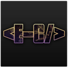

  

<h1><strong>¡Bienvenido a mi perfil! 👋</strong></h1>

## **🤔 ¿Quién soy yo?** ##

### Soy Eduardo Cruz; un programador Full-Stack, desarrollador web y diseñador gráfico. Me encanta la tecnología y las ciencias como la astronomía. Aspiro a ser un Data Scientist que ayude a desarrollar mejores alternativas para este planeta.

 

## **📖 Sobre mi** ##

- 🖥️ Perito en computación.
- 🆎 Inglés C1.
- 👓 Autodidacta.
- 🎓 Estudios en Centro Educativo Técnico Laboral Kinal.
- 👊 Trabajo en equipo.

 
<h2><strong>💻 Habilidades</strong></h2>
    
    
    
    
    
    
    
    
    
    
    

## **📒 Contacto** ##

### Puedes contactarme por medio de mis redes sociales:
  

> Muy pronto pondré una página web a manera de portafolio para que puedas ver mis proyectos más importantes.

<h3>¡Gracias por leer! ❤️</h3>
  

